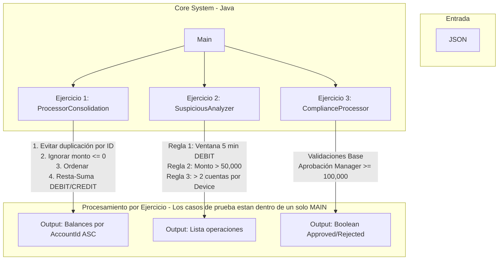

# Solución a Evaluación Técnica - Java Backend
Contiene en diferentes apartados la solución a 3 diferentes problemas, ademas de un solo MAIN.java, donde se agregan los casos de prueba.

## Estructura del Proyecto

El proyecto está organizado por paquetes independientes bajo una única arquitectura limpia:

```text
src/
├── main/java/
│   ├── Main.java          # Punto de entrada orquestador
│   ├── consolidation/     # Validar entrada, analizar json, entregar operaciones encontradas, de tiempo limite, monto, dispositivo
│   ├── suspicious/        # Detección de patrones y riesgo en operaciones
│   └── rules/             # Motor de reglas de cumplimiento, reestructura de un fragmento de código

```

---

## Diagrama de Arquitectura



---

## Instrucciones de Ejecución

### Requisitos previos
- **Java JDK:** 17 o superior.
- **Maven:** 3.8+ (o el wrapper `./mvnw` incluido).

### Pasos para compilar y ejecutar

1. **Clonar el repositorio:**
   ```bash
   git clone https://github.com/AlfEstbns/Tests.git
   cd Tests
   ```

2. **Compilar y Ejecutar la Aplicación Principal:**
   ```bash
   mvn clean package
   java -jar target/evaluacion-tecnica-1.0.0.jar
   ```
   *(O simplemente ejecutar la clase `Main.java` desde IntelliJ IDEA).*

---

## Decisión y Justificación Técnica

### 1. Nombres y Criterios de Diseño (Cumplimiento de Restricciones)
Se diseñó la arquitectura evitando el uso de nombres genéricos o prohibidos (processTransactions, detectFraud, etc.), se definieron nombres para hacer más facil una curva de aprendizaje.

ProcessorConsolidation / evaluateConsolidation: Evaluador de movimientos financieros que pueden venir duplicados.

SuspiciousAnalyzer / evaluateRisks: Responsable del análisis transaccional y reglas de fraude.

ComplianceProcessor / evaluateApproval: Evaluador de políticas de aprobación de crédito/operación.

### 2. Ejercicio 2: Detección de Operaciones Sospechosas
- **Manejo del Tiempo:** Se uso `java.time.Instant` para el parseo exacto de marcas de tiempo en formato ISO 8601.
- **Ordenamiento Autónomo:** Para garantizar que el orden de entrada de los movimientos no altere el resultado, se realiza un ordenamiento por fecha previo a la evaluación de la ventana de 5 minutos.

### 3. Ejercicio 3: Refactorización Clean Code
Se refactorizó la lógica utilizando **validaciones por separado**. Esto mejora la legibilidad, reduce la complejidad.

---

## Cobertura de Evidencia de Pruebas (Pruebas Manuales / Escenarios en Main)

La validación de la lógica de negocio de los 3 ejercicios se realizó mediante casos de prueba implementados en la clase principal (`Main.java`), cubriendo los siguientes escenarios:

- **Ejercicio 1:** Evitar duplicación de eventos por ID, filtrado de montos $\le 0$, ordenamiento y consolidación de balances por `accountId` en orden ascendente.
- **Ejercicio 2:** Evaluación de la ventana deslizante de 5 minutos para débitos frecuentes, alerta por montos $> 50,000$ y detección de dispositivos compartidos entre múltiples cuentas.
- **Ejercicio 3:** Evaluación de políticas de cumplimiento probando escenarios de éxito, rechazo por cuenta bloqueada, moneda no autorizada y flujo de aprobación por manager en montos $\ge 100,000$.
---

## Declaración de Uso de Documentación e IA Generativa

De acuerdo con las mejores prácticas de transparencia y colaboración profesional:
- **Herramientas de IA (Gemini):** Utilizada como asistente para la comprensión lectora de cada regla y estructuración de la documentación aqui presente, como creador de casos de prueba para los ejercicios.
- **Documentación Oficial:** Se consultó la documentación oficial de Java 17 (`java.time`) y Jackson para la correcta serialización de objetos a JSON.